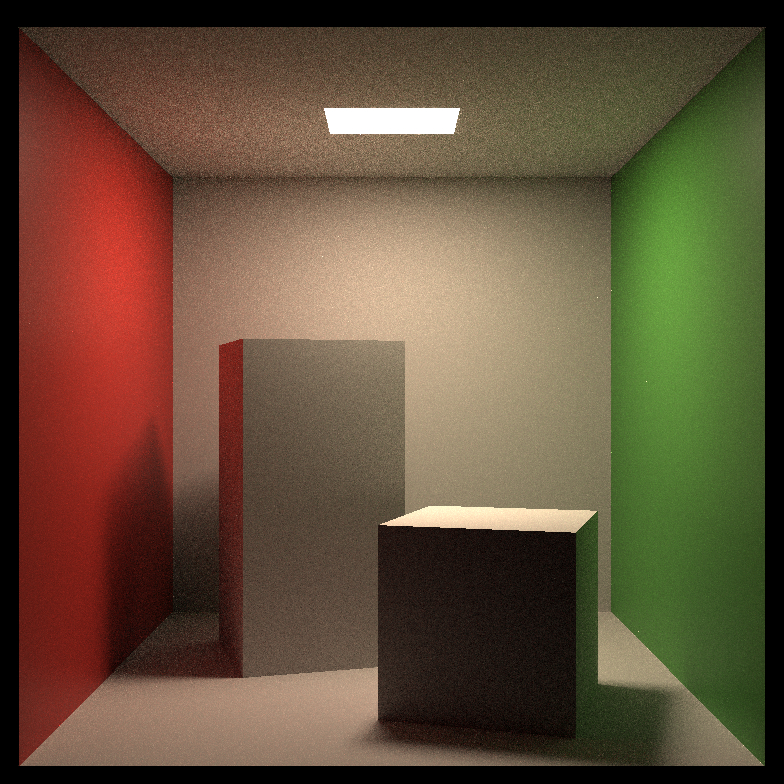
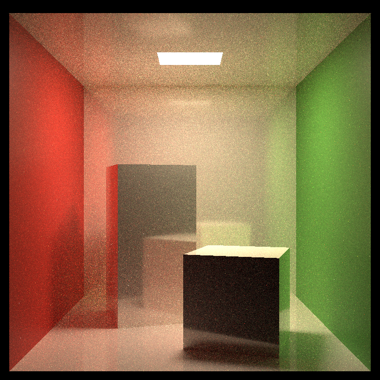
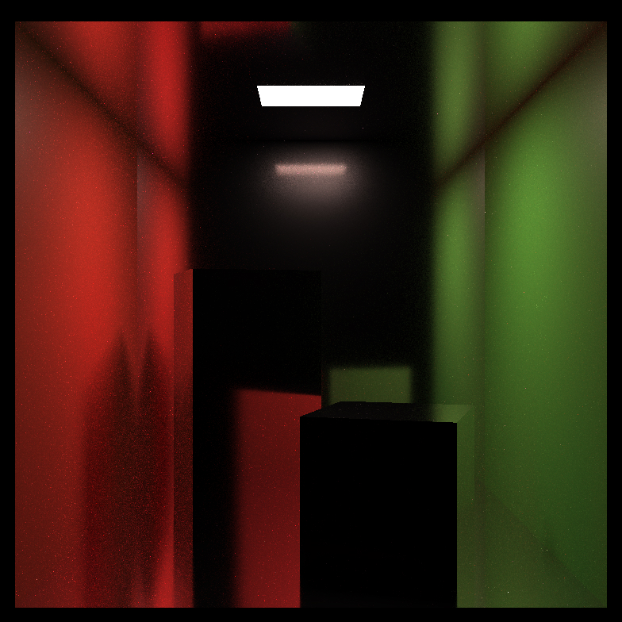
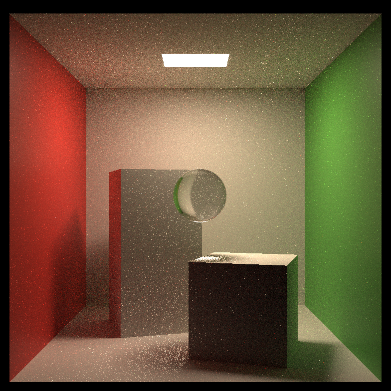

# Toy Path Tracer(GAMES-101 Assignment 7)
This is a simple path tracer, based on assignment 7 from the great online course GAMES-101(https://sites.cs.ucsb.edu/~lingqi/teaching/games101.html).  
Just for fun. won't be maintained in the future.  

## Features
* Multi-threading based on C++11.  
* Multi-importance sampling for direct illumination.    
* GGX microfacet model for BSDF and importance sampling.  
* Lambertian model is implemented for dieletric surface. It's combined with GGX microfacet model in a similar way to the game engine Unity.(Combined using fresnel term)
* Three types of material: Metal, Dieletric, Transmittance Dieletric.  

## Run
The scene is hard-coded in main.cpp.  

To build the program, type following to run cmake:  
```
mkdir build
cd build
cmake ..
```
And use make or VS depending on your platform.  

To start the program after built, type:   
```
./RayTracing -j [Thread count] -spp [Sample count per pixel]
``` 

## Images  
All images are rendered using 64 spps.  

Standard cornell box:  
    
Adjust material to smooth dieletric:  
   
Replace the white wall with silver:  
  
Refractive ball:   
  


## Tips  
During implementing I came across many problems, and I'd like to share some of my thoughts that could help others following GAMES-101 have a better time.  
* The original progress bar printing function is slow in Linux. And extremely slow under Windows(takes up 95% time on my computer). Print less contents, in less frequency.   
* The second slowest thing is C++ std random number generator. So I used the XorShift random number generator, which is super fast.  
* Add the C++ keyword `thread_local` to random number generator's seed, to avoid false sharing if you implement multi-threading.  
* Reset your random seed before rendering any pixel(or even reset it before each sample of the pixel). This makes sure you could later debug the pixel in an exactly same path. Of course different seed is required for each pixel. I use the pixel's index as the seed.  
* To implement multi-threading, the simplest way is to have a global pixel indexer, indicating which pixel is next to render, and let each thread query the index and increase it after got a job. This requires mutex locking, which is not good(Though this actually won't be a bottleneck I think, cause more time will be used during raytracing). A pretty easy fix is to assign each thread a thread index, and let each of them only fills the pixels with index `i * thread_count + thread_index`. In this way each pixel is assigned to a thread, and no mutex is required.  
* Only print the progress from one thread. Also don't waste time to make it very accurate by summing up all thread's current progress, it's just not needed.  
* For intersection test, glitches will often occur when we reflect a ray from any surface, if the ray intersects with the surface due to float precision. A simple solution is to add some offset to the start position, but I don't like it. Here I implmented simple face culling to triangle and sphere intersection test function. Normally we just culls back face hit, so when a ray reflects from surface, since the surface normal is same side with reflect direction, any hit will be ignored. And this is even more useful for refraction, Once the ray is refracted, we flip the face culling to cull front face, so ray could only hit inside the object.  

# References
1. [GAMES-101 Introduction](https://sites.cs.ucsb.edu/~lingqi/teaching/games101.html)  
1. [Microfacet Models for Refraction through Rough Surfaces](https://www.cs.cornell.edu/~srm/publications/EGSR07-btdf.pdf)  
1. [Chapter 9 Multiple Importance Sampling - Stanford Graphics](https://graphics.stanford.edu/courses/cs348b-03/papers/veach-chapter9.pdf)  
1. [RefractiveIndex.Info](https://refractiveindex.info/)  
1. [Coding Labs - Physically Based Rendering](http://www.codinglabs.net/article_physically_based_rendering.aspx)